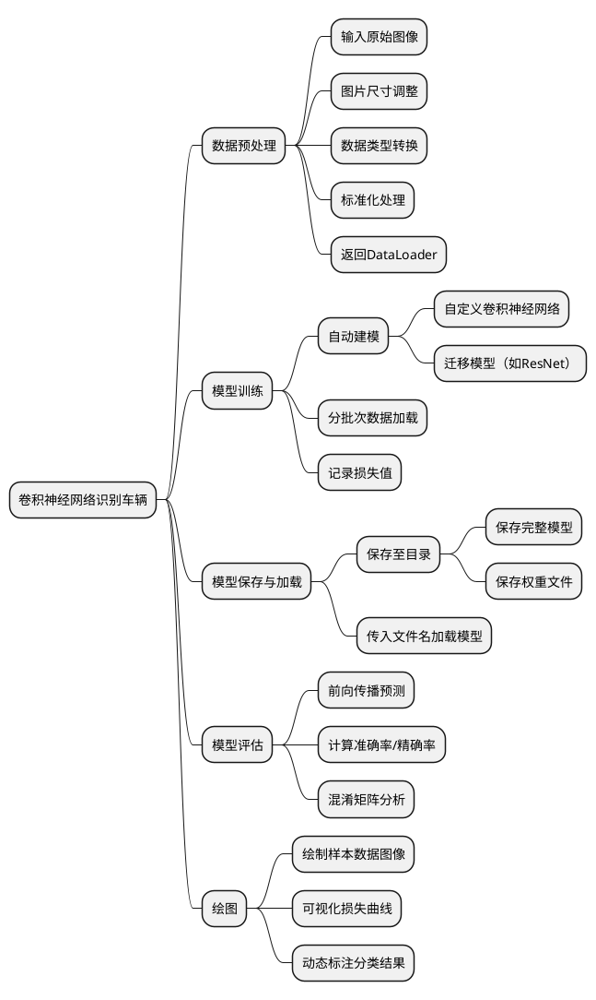
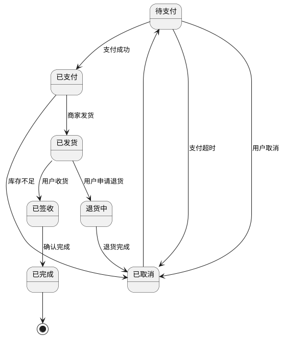
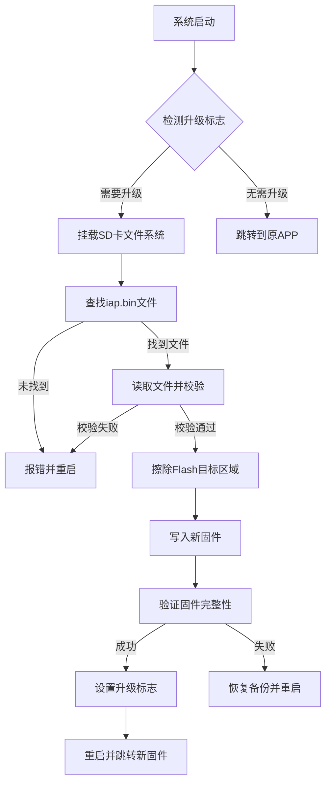

# 成长计划

- 开发环境: Git, Cmake, Make, GCC, GDB, OpenOCD
- 编程语言: C, C++, Python, Verilog
- 微控制器: STM32, GD32, ESP32, AG32, 瑞萨
- 通信协议: OneWire, IIC, SPI, UART, CAN, USB, BLE, ETH, MQTT
- 操作系统: RT-Thread, FreeRTOS
- 中间组件: FatFS, LWIP, TinyUSB, LVGL

> 1. 良好的编程规范, 面向对象思想编程, 设计模式
> 2. 分层架构, 熟悉CorteM架构
> 3. 熟悉上位机设计QT, 掌握socket网络编程
> 4.  熟悉Jlink, DAP-Link, JTAG, SWD调试

软件: MCU-->Linux
硬件: PCB-->FPGA
架构: 轮询, 中断, 状态机, RTOS

---

# 工作任务

| List |                   现存问题                   | 现在状态 |           原因           |             解决方法             |
| ---- | ------------------------------------------- | -------- | ------------------------ | ------------------------------- |
| 01   | <mark>接入屏幕任务上位机无法控制DDS发生</mark> | 已完成   |                          |                                 |
| 02   | <mark>上位机和屏幕显示过载</mark>             | 已完成   | ADC悬空,采集错误          | 屏蔽ADC采集任务                  |
| 03   | <mark>PC连接屏幕不显示联机界面</mark>          | 已完成   | 连锁错误                 | 连锁错误,修改枚举定义             |
| 04   | <mark>DDS发生固定频率不可调节</mark>          | 已完成   | 代码是写死的              | 函数封装, 读取寄存器设置频率       |
| 05   | <mark>添加上位机控制DDS挡位输出</mark>         | 已完成   | 缺少代码                 | 在上位机解析代码段设置寄存器并控制 |
| 06   | <mark>添加屏幕控制DDS</mark>                 | 已完成   | 缺少代码                 | 在协议解析代码段设置寄存器并控制   |
| 07   | <mark>上位机DDS挡位调节不灵敏</mark>          | 已完成   | 上位机后台UI未更新        | 添加更新代码                     |
| 08   | 上位机缺少DDS通道控制选择                      | NONE     |                          |                                 |
| 09   | <mark>上位机大端发送,单片机小端接收</mark>     | 已完成   | 大小端不匹配              | 调整代码                         |
| 10   | <mark>接入上位机,屏幕就显示过载</mark>         | 已完成   | 枚举值定义错误,枚举重复    | 修改枚举定义                     |
| 11   | <mark>上位机控制启停逻辑相反</mark>            | 已完成   | 通信协议工作状态段设置错误 | 修改通信协议工作状态段            |
- **问题1:**
`上位机的挡位是控制POWER寄存器的吗,FREQ寄存器是控制频率的,那POWER寄存器有什么用,`
`上位机也没有控制频率的设置,如果是根据挡位设置频率,那每个挡位对应多少频率呢`

- **问题2**
为什么AG32的串口输出信息是乱码,波特率设置的是115200没错啊

- **问题3**
解析屏幕控制DDS挡位信号后是不是应该更新到power寄存器,dds_power_level_index的作用

- **问题4** (user_communication.c --> send_current_page_power_level_cmd --> line: 514)
dds不是10挡吗,怎么还有大于10和大于100的

---

# 心理聊天与普通聊天的不同

1. 普通聊天以自我为中心
2. 普通聊天喜欢反驳他人,夸大自己的观点 
3. 普通聊天喜欢输出自己的观点

1. 心理话聊是不断在第一人称视角和第三人称视角抓换的
2. 以第一视角感受谈话者的经历,历史重演,感同身受
3. 以第三人称的视角冷静引导,不要被谈话者的情绪影响,客观谨慎的给出建议 

**心理咨询师 != 心理医生**
* 心理咨询师不需要医学专业背景,不一定需要心理学背景,是一种职业技能证书,类似与电工证书,教师证,无人机证书等
	解决的是生活中的烦恼, 压力, 疏导心情,主要依靠话聊
* 心理医生需要医学背景,解决的是抑郁症, 厌食症, 精神分裂症等,不太需要话聊, 主要是根据症状诊断下药

---

