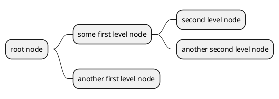
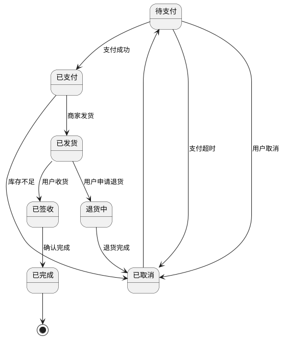
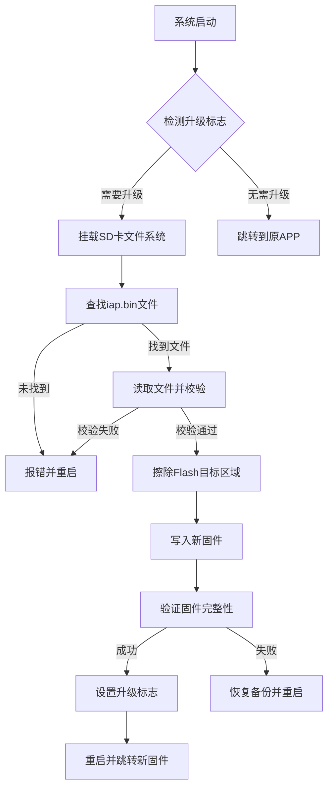

# 待办事项
---
- [ ] 软件实现IIC,SPI,和硬件IIC,SPI对比,软件模拟HAL库硬件的传输接口
- [ ] 熟悉STM32F407常用外设,学习QT,C++上位机多文件文件夹开发 

# 学习任务
---
- C,C++,Python,汇编语言
- QT上位机UI,LVGL下位机UI
- 计算机网络协议栈,`Lwip`网络协议实现
- 实时操作系统`RT-Thread`,FreeRTOS
- 学习`FatFS`嵌入式文件系统
- GNU 开发工具链,cmake, makefile, gcc/g++, make
- RS232,RS485物理层电平协议,链路层协议,应用层协议(TCP/IP四层模型)

---
- 开发环境: Linux, Github, Cmake, Make, GNU, GDB, OpenOCD
- 编程语言: C, C++, Python, Verilog, VHDL
- 微控制器: 51, STM32, ESP32, GD32, 瑞萨
- 通信协议: OneWire, IIC, SPI, UART, CAN, USB, ETH, Modbus
- 操作系统: RT-Thread, FreeRTOS
- 中间组件: FatFS, LWIP, TinyUSB
- 人机交互: QT, LVGL

---
**上位机代码阅读**
- 串口发送
- 错误打印
- usb协议解析,发送
- 主窗口界面UI布置
> ui->setup();
- 主窗口界面操作

上位机连接确定按钮 没有发送 通信协议 
需添加通信协议

软件-->算法-->人工智能-->AI
硬件-->PCB-->芯片-->机器人

