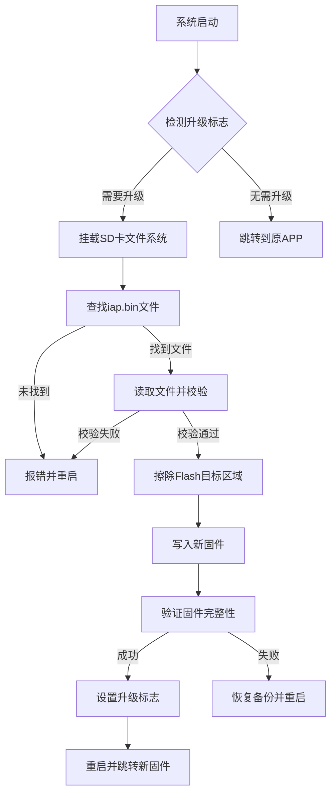

# 单片机学习
**ADC使用流程:**
```C
HAL_ADC_Start(&hadc1);
HAL_ADC_PollForConversion(&hadc1,0xffff);
Value = HAL_ADC_GetValue(&hadc1);
HAL_ADC_Stop(&hadc1);
```

- [STM32 之 Core Coupled Memory（CCM）内存](https://blog.csdn.net/longor1991/article/details/86150952)
- [SD卡初始化](https://www.cnblogs.com/sun-1989/p/3383756.html)
- [CCM内存](https://blog.csdn.net/longor1991/article/details/86150952)
- [STM32键盘](https://blog.csdn.net/qq_21566881/article/details/127926484)




