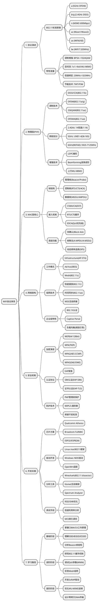

# WIFI协议栈

```puml
@startmindmap
* WiFi协议体系
** 1. 协议演进
*** 802.11标准家族
**** a (5GHz OFDM)
**** b/g (2.4GHz DSSS)
**** n (MIMO 600Mbps)
**** ac (Wave1/Wave2)
**** ax (WiFi6/6E)
**** be (WiFi7 320MHz)
*** 特性发展
**** 调制增强: BPSK->1024QAM
**** 空间流: 1x1->8x8 MU-MIMO
**** 信道绑定: 20MHz->320MHz
**** 节能技术: TWT/PSM

** 2. 物理层(PHY)
*** 调制技术
**** DSSS/CCK(802.11b)
**** OFDM(802.11a/g)
**** 256QAM(802.11ac)
**** OFDMA(802.11ax)
*** 频段划分
**** 2.4GHz: 14信道(1-14)
**** 5GHz: UNII1-4(36-165)
**** 6GHz(WiFi6E): 5925-7125MHz
*** 增强技术
**** LDPC编码
**** Beamforming波束成形
**** 上行MU-MIMO

** 3. MAC层核心
*** 帧结构
**** 管理帧(Beacon/Probe)
**** 控制帧(RTS/CTS/ACK)
**** 数据帧(MSDU/AMPDU)
*** 接入机制
**** CSMA/CA(DCF)
**** RTS/CTS握手
**** EDCA(QoS优先级)
*** 高级功能
**** 块确认(Block Ack)
**** 帧聚合(A-MPDU/A-MSDU)
**** 动态频率选择(DFS)

** 4. 网络架构
*** 工作模式
**** Infrastructure(AP-STA)
**** Ad-hoc(IBSS)
**** Mesh(802.11s)
*** 组网技术
**** 快速漫游(802.11r)
**** 时间同步(802.11as)
**** WDS无线桥接
*** 企业级特性
**** 802.1X认证
**** Captive Portal
**** 负载均衡(频段引导)

** 5. 安全机制
*** 加密演进
**** WEP(64/128bit)
**** WPA(TKIP)
**** WPA2(AES-CCMP)
**** WPA3(SAE/OWE)
*** 认证协议
**** EAP家族
**** SIM认证(EAP-SIM)
**** 证书认证(EAP-TLS)
*** 防护技术
**** PMF管理帧保护
**** WIPS入侵防御
**** 频谱干扰检测

** 6. 开发实践
*** 芯片方案
**** Qualcomm Atheros
**** Broadcom FullMAC
**** ESP32/ESP8266
*** 驱动开发
**** Linux mac80211框架
**** Windows NDIS驱动
**** OpenWrt适配
*** 分析工具
**** Wireshark(802.11 dissector)
**** Kismet无线嗅探
**** Spectrum Analyzer
*** 调试手段
**** RSSI/SNR优化
**** 信道利用率分析
**** MCS索引调优

** 7. 学习路径
*** 基础阶段
**** 掌握CSMA/CA工作原理
**** 理解SSID/BSSID/ESSID
**** 分析Beacon帧结构
*** 进阶阶段
**** 研究802.11握手机制
**** 调试QoS参数(WMM)
**** 实现Mesh组网
*** 高阶阶段
**** 开发SoftAP驱动
**** 优化MU-MIMO波束
**** 设计零拷贝DMA传输
@endmindmap
```